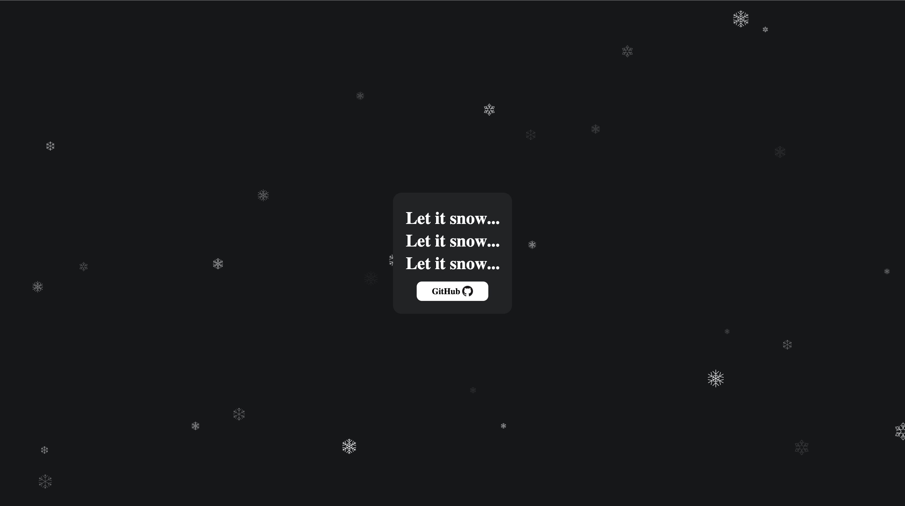

# Let it Snow

### A lightweight JavaScript library for creating a "snow effect." This project has been inspired by particles.js.



------------------------------
-------------------------------
### `Usage`


Load letItSnow.js and configure letItSnow.json:

**index.html**
```html
<div id="snowFlakesJS"></div>

<script src="./letItSnow.js"></script>
```

**JavaScript**
```javascript
/* window.letItSnow(elementId, path to json config file)*/
window.letItSnow("letItSnowJS", "./letItSnow.json");
```

**letItSnow.json**
```javascript
{
    "snowFlakes": {
        "number": 30,
        "images": [
            "images/snowflake1.svg",
            "images/snowflake2.svg",
            "images/snowflake3.svg",
            "images/snowflake4.svg"
        ],
        "opacity": {
            "random": true,
            "value": 0.5
        },
        "sizes": {
            "random": true,
            "value": 40,
            "min": 20,
            "max": 50
        },
        "velocity": {
            "direction": "d",
            "speed": {
                "random": true,
                "value": 6,
                "min": 4,
                "max": 8
            },
            "angle": {
                "random": true,
                "value": 45,
                "min": 10,
                "max": 40
            }
        }
    }
}
```

-------------------------------

### `Options`

key | type / note | example
----|---------|------
`snowFlakes.number` | number | `30`
`snowFlakes.images` | array of image paths | `images/snowflake1.svg`
`snowFlakes.opacity.random` | boolean | `true` / `false`
`snowFlakes.opacity.value` | number (between 0 and 1) | `0.25`
`snowFlakes.sizes.random` | boolean | `true` / `false`
`snowFlakes.sizes.value` | number | `40`
`snowFlakes.sizes.min` | number | `20`
`snowFlakes.sizes.max` | number | `50`
`snowFlakes.velocity.direction` | string | `"u" for up`<br/>`"d" for down`<br/>`"l" for left`<br/>`"r" for right`
`snowFlakes.velocity.speed.random` | boolean | `true` / `false`
`snowFlakes.velocity.speed.value` | number | `6`
`snowFlakes.velocity.speed.min` | number | `4`
`snowFlakes.velocity.speed.max` | number | `8`
`snowFlakes.velocity.angle.random` | boolean | `true` / `false`
`snowFlakes.velocity.angle.value` | number / between 0 and 90 | `30`
`snowFlakes.velocity.angle.min` | number / min 0 | `10` 
`snowFlakes.velocity.angle.max` | number / max 90 | `40`
